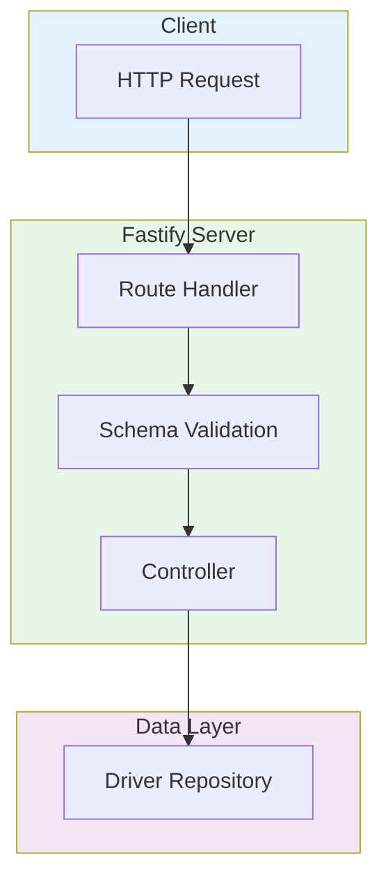

# Formula 1 Minimal API - Node.js + Fastify

[](https://typescriptlang.org)
[](https://nodejs.org)
[](https://fastify.io)
[](LICENSE)
[](Dockerfile)
[](Dockerfile)

[English](#english) | [Portugues (BR)](#portugues-br)

---

## English

### Overview

Minimal REST API for Formula 1 driver data built with Node.js, Fastify, and TypeScript. Features high-performance HTTP endpoints for querying driver information, team standings, and race statistics using Fastify's low-overhead architecture. Developed as part of a DIO bootcamp challenge.

### Architecture


```mermaid
graph TB
    subgraph Client["Client"]
        A[HTTP Request]
    end
    subgraph Server["Fastify Server"]
        B[Route Handler]
        C[Schema Validation]
        D[Controller]
    end
    subgraph Data["Data Layer"]
        E[Driver Repository]
    end
    A --> B --> C --> D --> E
    style Client fill:#e3f2fd
    style Server fill:#e8f5e9
    style Data fill:#f3e5f5
```

### Key Features

- **Driver Data API** -- Query F1 driver information including teams, points, and rankings
- **Fastify Performance** -- Low-overhead HTTP framework with schema-based validation
- **TypeScript Safety** -- Full type coverage for request/response handling
- **Schema Validation** -- JSON Schema validation for all API inputs
- **RESTful Endpoints** -- Clean REST API design following HTTP standards
- **Minimal Architecture** -- Lightweight API focused on performance and simplicity

### Industry Application

This project demonstrates high-performance API design patterns applicable to sports data platforms, real-time statistics services, and content delivery APIs. Fastify's low-latency architecture is ideal for fintech tickers, IoT data ingestion, and gaming leaderboard services.

### Tech Stack

| Technology | Purpose |
|------------|---------|
| **TypeScript 5.0+** | Type-safe application logic |
| **Node.js** | Runtime environment |
| **Fastify** | High-performance HTTP framework |
| **Docker** | Containerized deployment |

### Quick Start

```bash
git clone https://github.com/galafis/Criando-uma-Minimal-API-da-Formula-1-com-Node.js-e-Fastify.git
cd Criando-uma-Minimal-API-da-Formula-1-com-Node.js-e-Fastify
npm install
npm run dev
```

### Docker

```bash
docker build -t f1-api .
docker run -p 3000:3000 f1-api
```

### Project Structure

```
Criando-uma-Minimal-API-da-Formula-1-com-Node.js-e-Fastify/
├── src/
├── examples/
├── Dockerfile
├── package.json
├── tsconfig.json
└── LICENSE
```

### License

This project is licensed under the MIT License - see the [LICENSE](LICENSE) file for details.

### Author

**Gabriel Demetrios Lafis**
- GitHub: [@galafis](https://github.com/galafis)
- LinkedIn: [Gabriel Demetrios Lafis](https://linkedin.com/in/gabriel-demetrios-lafis)

---

## Portugues (BR)

### Visao Geral

API REST minimalista para dados de pilotos de Formula 1 construida com Node.js, Fastify e TypeScript. Apresenta endpoints HTTP de alto desempenho para consulta de informacoes de pilotos, classificacoes de equipes e estatisticas de corridas usando a arquitetura de baixa sobrecarga do Fastify. Desenvolvida como parte de um desafio do bootcamp DIO.

### Principais Funcionalidades

- **API de Dados de Pilotos** -- Consulta de informacoes de pilotos de F1 incluindo equipes, pontos e classificacoes
- **Performance Fastify** -- Framework HTTP de baixa sobrecarga com validacao baseada em schema
- **Seguranca TypeScript** -- Cobertura completa de tipos para manipulacao de request/response
- **Endpoints RESTful** -- Design de API REST limpo seguindo padroes HTTP

### Inicio Rapido

```bash
git clone https://github.com/galafis/Criando-uma-Minimal-API-da-Formula-1-com-Node.js-e-Fastify.git
cd Criando-uma-Minimal-API-da-Formula-1-com-Node.js-e-Fastify
npm install
npm run dev
```

### Licenca

Este projeto esta licenciado sob a Licenca MIT - veja o arquivo [LICENSE](LICENSE) para detalhes.

### Autor

**Gabriel Demetrios Lafis**
- GitHub: [@galafis](https://github.com/galafis)
- LinkedIn: [Gabriel Demetrios Lafis](https://linkedin.com/in/gabriel-demetrios-lafis)
