# 🏎️ API de Pilotos de Fórmula 1 — Node.js + Fastify + TypeScript

<div align="center">


</div>


**Construa sua própria escuderia de Fórmula 1!**
Este projeto cria uma API leve, rápida e eficiente utilizando Node.js, Fastify e TypeScript, com armazenamento em memória e estrutura pronta para evoluir com banco de dados real.

---

## 🏗️ Arquitetura da API

```mermaid
graph TD
    Client["🖥️ Cliente (REST Client / Browser)"]
    Fastify["⚡ Fastify Server\n(Node.js + TypeScript)"]
    Router["🔀 Router / Routes"]
    Handler["📦 Route Handlers"]
    Store["🗄️ In-Memory Store\n(drivers[ ])"]

    Client -->|"HTTP Request"| Fastify
    Fastify --> Router
    Router -->|"POST /drivers"| Handler
    Router -->|"GET /drivers"| Handler
    Router -->|"GET /drivers/:id"| Handler
    Router -->|"PUT /drivers/:id"| Handler
    Router -->|"DELETE /drivers/:id"| Handler
    Handler <-->|"Read / Write"| Store
    Handler -->|"HTTP Response (JSON)"| Client
```



---

## 🔄 Fluxo de Requisições

```mermaid
sequenceDiagram
    participant C as Cliente
    participant F as Fastify
    participant H as Handler
    participant S as Store (Memória)

    C->>F: POST /drivers { name, team, points }
    F->>H: Valida corpo da requisição
    H->>S: Insere novo piloto com UUID
    S-->>H: Piloto criado
    H-->>C: 201 Created { id, name, team, points }

    C->>F: GET /drivers
    F->>H: Rota sem parâmetros
    H->>S: Busca todos os pilotos
    S-->>H: Array de pilotos
    H-->>C: 200 OK [ { id, name, team, points }, ... ]

    C->>F: PUT /drivers/:id { points: 25 }
    F->>H: Extrai parâmetro :id
    H->>S: Localiza e atualiza piloto
    S-->>H: Piloto atualizado
    H-->>C: 200 OK { id, name, team, points }

    C->>F: DELETE /drivers/:id
    F->>H: Extrai parâmetro :id
    H->>S: Remove piloto do array
    S-->>H: Confirmação
    H-->>C: 204 No Content
```



---

## 🚀 Como Rodar o Projeto

1. Clone o repositório ou baixe o ZIP.
2. No terminal, entre na pasta do projeto.
3. Instale as dependências:
   ```bash
   npm install
   ```
4. Para rodar em modo desenvolvimento:
   ```bash
   npm run dev
   ```
5. Para rodar em produção:
   ```bash
   npm run build
   npm start
   ```

Servidor rodando em: `http://localhost:3333`

---

## 🎯 Endpoints da API

| Método | Rota              | Descrição                  |
|--------|-------------------|----------------------------|
| POST   | `/drivers`        | Criar novo piloto           |
| GET    | `/drivers`        | Listar todos os pilotos     |
| GET    | `/drivers/:id`    | Buscar piloto por ID        |
| PUT    | `/drivers/:id`    | Atualizar piloto existente  |
| DELETE | `/drivers/:id`    | Remover piloto              |

### Exemplo de Payload (POST / PUT)

```json
{
  "name": "Max Verstappen",
  "team": "Red Bull Racing",
  "points": 575
}
```

### Exemplo de Resposta

```json
{
  "id": "a1b2c3d4-...",
  "name": "Max Verstappen",
  "team": "Red Bull Racing",
  "points": 575
}
```

---

## 🛠️ Tecnologias Usadas

| Tecnologia       | Versão    | Função                          |
|------------------|-----------|---------------------------------|
| Node.js          | 18+       | Runtime JavaScript              |
| Fastify          | 4.x       | Framework HTTP de alta performance |
| TypeScript       | 5.x       | Tipagem estática                |
| ts-node-dev      | latest    | Hot reload em desenvolvimento   |

---

## ✨ Melhorias Futuras

- Implementar banco de dados real (MongoDB ou PostgreSQL).
- Usar ORM como Prisma ou TypeORM.
- Implementar autenticação JWT.
- Adicionar paginação de resultados.
- Adicionar validação de schema com Zod.
- Melhorar a análise de dados dos pilotos com estatísticas.

*Os pontos de expansão estão comentados no código para facilitar futuras integrações.*

---

## 📝 Inspiração

Projeto inspirado no desafio prático da DIO:
[https://github.com/digitalinnovationone/node-formula-1](https://github.com/digitalinnovationone/node-formula-1)

---

## 📄 Licença

MIT License — sinta-se livre para usar, modificar e distribuir.

---

---

# 🏎️ Formula 1 Drivers API — Node.js + Fastify + TypeScript

**Build your own Formula 1 team!**
This project delivers a lightweight, fast, and efficient API using Node.js, Fastify, and TypeScript, with in-memory storage and a structure ready to evolve with a real database.

---

## 🏗️ API Architecture

```mermaid
graph LR
    subgraph Client Side
        REST["REST Client / Browser"]
    end
    subgraph Server Side
        Fastify["⚡ Fastify Server"]
        Router["🔀 Route Layer"]
        Handlers["📦 Handlers"]
        Store["🗄️ In-Memory Store"]
    end

    REST -->|HTTP| Fastify
    Fastify --> Router
    Router --> Handlers
    Handlers <--> Store
    Handlers -->|JSON Response| REST
```



---

## 🚀 Getting Started

1. Clone the repository or download the ZIP.
2. Navigate to the project folder.
3. Install dependencies:
   ```bash
   npm install
   ```
4. Run in development mode:
   ```bash
   npm run dev
   ```
5. Run in production:
   ```bash
   npm run build
   npm start
   ```

Server running at: `http://localhost:3333`

---

## 🎯 API Endpoints

| Method | Route             | Description              |
|--------|-------------------|--------------------------|
| POST   | `/drivers`        | Create a new driver       |
| GET    | `/drivers`        | List all drivers          |
| GET    | `/drivers/:id`    | Get driver by ID          |
| PUT    | `/drivers/:id`    | Update existing driver    |
| DELETE | `/drivers/:id`    | Remove a driver           |

---

## 🛠️ Tech Stack

| Technology   | Role                        |
|--------------|-----------------------------|
| Node.js      | JavaScript runtime          |
| Fastify      | High-performance HTTP framework |
| TypeScript   | Static typing               |
| ts-node-dev  | Hot reload for development  |

---

## 📄 License

MIT License — feel free to use, modify, and distribute.


---

## English

### Overview

🏎️ API de Pilotos de Fórmula 1 — Node.js + Fastify + TypeScript - A project built with JavaScript, TypeScript, Java, SQL, Node.js, developed by Gabriel Demetrios Lafis as part of professional portfolio and continuous learning in Data Science and Software Engineering.

### Key Features

This project demonstrates practical application of modern development concepts including clean code architecture, responsive design patterns, and industry-standard best practices. The implementation showcases real-world problem solving with production-ready code quality.

### How to Run

1. Clone the repository:
   ```bash
   git clone https://github.com/galafis/Criando-uma-Minimal-API-da-Formula-1-com-Node.js-e-Fastify.git
   ```
2. Follow the setup instructions in the Portuguese section above.

### License

This project is licensed under the MIT License. See the [LICENSE](LICENSE) file for details.

---

Developed by [Gabriel Demetrios Lafis](https://github.com/galafis)
